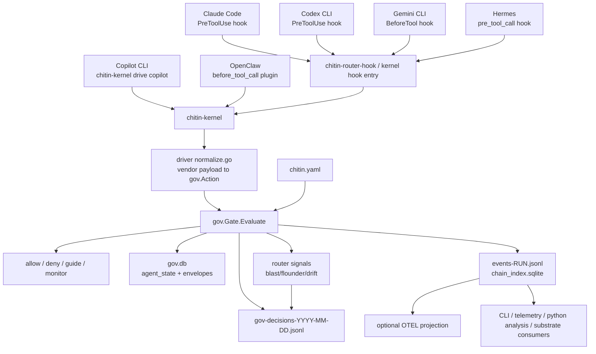
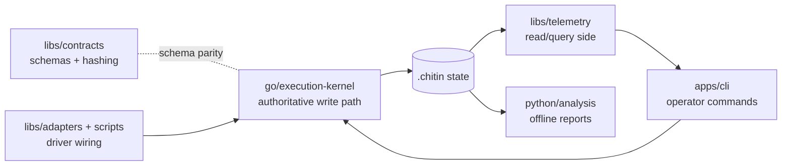
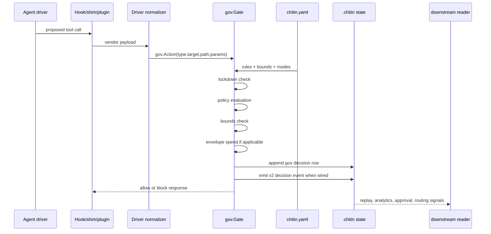
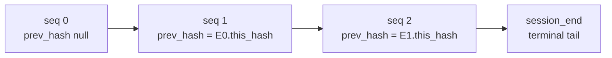

# Chitin NotebookLM Ingest Audit

Audit date: 2026-05-09

Purpose: this is a single-file, NotebookLM-friendly synthesis of the
`chitin` repository. It is written to be uploaded as a source document
for question-answering, orientation, and planning. It summarizes the
product boundary, live architecture, code layout, data model, driver
integrations, policy surface, shipped/deferred work, and current audit
findings.

## Executive Summary

Chitin is an execution governance runtime for heterogeneous AI coding
agents. Its core product is a Go kernel, `chitin-kernel`, that sits in
the tool-call path of supported coding agents, normalizes each proposed
tool call into a shared action vocabulary, evaluates it against
`chitin.yaml`, writes a tamper-evident audit chain, and stamps
cross-driver signals for downstream consumers.

Chitin is not an orchestrator, approval system, model router, MCP host,
SaaS product, or agent framework. Those roles belong to substrates such
as Hermes, OpenClaw, Claude Code, Codex CLI, Gemini CLI, and Copilot CLI.
Chitin's asymmetric value is the cross-driver governance layer beneath
those substrates.

The live system is local-first and file-backed. The kernel writes to a
`.chitin` state directory, usually `~/.chitin`, with canonical JSONL
logs plus SQLite indexes/counters. TypeScript packages provide schemas,
read-side telemetry, CLI wrappers, and thin adapters. Python analysis
tools read the same chain to derive policy and routing insights.

The 2026-05-06 and 2026-05-08 cull passes are load-bearing context:
chitin deliberately removed orchestration, operator approvals, in-gate
LLM consultation, MCP server hosting, and a parallel TypeScript
governance substrate. The Go kernel is the canonical decision path.

## One-Sentence Product Definition

Chitin is local execution policy middleware for AI coding agents: every
driver's tool call is translated into a canonical action, evaluated by
one policy engine, and recorded in one replayable audit chain.

## What Chitin Is

- A Go execution kernel for tool-call governance.
- A cross-driver normalizer for Claude Code, Codex, Gemini, Hermes,
  Copilot CLI, and OpenClaw.
- A typed policy evaluator backed by `chitin.yaml`.
- A tamper-evident event and decision chain.
- A severity ladder and lockdown counter for agent behavior.
- A bounds enforcer for push-shaped actions.
- A source of heuristic signals: blast radius, floundering, and drift.
- A local data layer for replay, analytics, and policy derivation.

## What Chitin Is Not

- Not an orchestrator: no kanban, dispatch, work queues, cron workflow,
  retries, or durable task execution.
- Not an approval system: Hermes owns operator approvals through its
  native `tools/approval.py` flow.
- Not an LLM runner: the kernel does not call `claude -p` or any other
  model in the hot path.
- Not an MCP server host: Hermes and OpenClaw can host MCP tools that
  call `chitin-kernel` subcommands.
- Not an agent framework: agents run in their own runtimes.
- Not a model router: drivers and orchestrators choose models.
- Not SaaS: operator-owned local files are the source of truth.

## Architectural Thesis

Chitin's moat is cross-driver execution governance. Individual agent
substrates can observe their own tool calls, but chitin is designed to
normalize and govern tool calls across many substrates with one action
enum, one policy file, one audit chain, and one severity model.

The key positioning question for any proposed change is:

> Does this deepen cross-driver canonical governance, tamper-evident
> chain depth, driver coverage, typed policy, bounds enforcement, or
> chain-derived signals?

If the answer is no, the feature likely belongs in Hermes, OpenClaw, the
driver CLI, or another substrate.

## System Diagram



ASCII summary:

```text
drivers -> hook/plugin/wrapper -> chitin-kernel
        -> driver normalizer -> gov.Gate.Evaluate(chitin.yaml)
        -> decision + bounds + counter + envelope
        -> JSONL decision log + hash-linked event chain + optional OTEL
        -> read-side tools and downstream substrates
```

## Repository Buckets

The repository is allowed to ship four kinds of code.

| Bucket | Paths | Role |
|---|---|---|
| Kernel | `go/execution-kernel/` | Authoritative side-effect and governance binary. |
| Analytics libs | `python/analysis/`, `libs/contracts/`, `libs/telemetry/` | Read chain data, define schemas, derive insights. |
| Plugins/adapters | `libs/adapters/*`, `apps/openclaw-plugin-governance/`, `libs/router-plugin-api/*` | Driver-side integration surfaces and plugin helper APIs. |
| Apps built off kernel | `apps/cli/` | Operator CLI that wraps kernel and read-side libs. |

Anything outside those buckets should be treated skeptically.

## Important Paths

| Path | Meaning |
|---|---|
| `go/execution-kernel/cmd/chitin-kernel/` | CLI command surface for the kernel binary. |
| `go/execution-kernel/internal/gov/` | Canonical policy, action enum, bounds, counters, decisions. |
| `go/execution-kernel/internal/driver/` | Per-driver normalizers for vendor tool payloads. |
| `go/execution-kernel/internal/chain/` | SQLite chain index and JSONL reconciliation. |
| `go/execution-kernel/internal/emit/` | Canonical event append path and optional OTEL projection. |
| `go/execution-kernel/internal/router/` | Pure-Go heuristic signals and plugin runner. |
| `libs/contracts/` | TypeScript Zod schemas and deterministic hash helpers. |
| `libs/telemetry/` | Read-side JSONL tailer, SQLite indexer, replay helpers. |
| `apps/cli/` | Operator-facing `chitin` CLI. |
| `apps/openclaw-plugin-governance/` | OpenClaw plugin that calls the kernel gate. |
| `python/analysis/` | Offline chain readers, policy/debt analyses, report writers. |
| `docs/decisions/` | Architectural truth source when docs disagree. |
| `chitin.yaml` | Baseline local governance policy. |

## Live Layer Model



Layer invariant: the Go kernel is the only authoritative write and
enforcement path. TypeScript and Python are schema/read/adapter surfaces,
not alternate governance engines.

## Kernel Command Surface

The current `chitin-kernel` binary dispatches these top-level commands:

- `init`
- `emit`
- `chain-info`
- `chain-verify`
- `chain replay`
- `chain summarize`
- `chain related`
- `chain snapshot`
- `chain stats`
- `chain recommend-tier`
- `ingest-transcript`
- `ingest-otel`
- `ingest-hermes`
- `sweep-transcripts`
- `install-hook`
- `uninstall-hook`
- `install`
- `uninstall`
- `health`
- `gate evaluate`
- `gate status`
- `gate lockdown`
- `gate reset`
- `envelope create`
- `envelope use`
- `envelope inspect`
- `envelope list`
- `envelope grant`
- `envelope close`
- `envelope tail`
- `decisions recent`
- `router evaluate`
- `simulate`
- `drive copilot`

The command surface is important because the 2026-05-08 MCP cull
removed a separate MCP server. Substrates should expose chitin tools by
calling these kernel subcommands, not by hosting a second chitin MCP
implementation.

## Runtime Evaluation Flow



The gate sequence in code is:

1. Lockdown short-circuit if the agent is locked.
2. Policy evaluation.
3. Bounds check for push-shaped actions.
4. Monitor-mode override for policy decisions.
5. Budget envelope spend on allow.
6. Counter increment on policy/bounds deny, excluding budget denials.
7. Decision stamping with envelope, cost, tier, caller, and fingerprint
   dimensions.
8. Decision log append and optional chain event callback.

## Policy Model

`chitin.yaml` is a declarative policy file with:

- Global mode, currently baseline `enforce`.
- Bounds for push-shaped actions, including per-action overrides.
- Escalation thresholds for severity ladder and lockdown.
- Invariant modes for named safety checks.
- Ordered rules with `id`, `action`, `effect`, target predicates, reason,
  suggestions, corrected commands, and escalation weights.

Representative baseline denials:

- Recursive delete (`file.recursive_delete`).
- Shell commands containing destructive `rm -rf` patterns.
- Force push.
- Bare or protected branch pushes.
- `.env` writes.
- Writes/deletes under system and credential paths.
- Governance self-modification (`chitin.yaml`, `.chitin`, chitin plugin
  locations).
- Terraform destroy.
- Remote code execution via curl/wget/fetch piped into shells.

Representative baseline allows:

- Reads.
- Git reads.
- GitHub read operations.
- GitHub state-changing operations with bounds where relevant.
- Non-push git operations.
- Non-protected git pushes.
- Tests.
- Delegation.
- HTTP requests.
- MCP calls.
- Shell exec by default after specific dangerous patterns are denied.
- File writes by default after sensitive destinations are denied.

Important cull note: `effect: escalate` has been removed. Stale policies
using escalate should fail loudly rather than silently reintroducing
chitin-side operator approval machinery.

## Canonical Governance Action Vocabulary

The live authoritative enum is `go/execution-kernel/internal/gov/action.go`.
It includes:

- Shell and filesystem: `shell.exec`, `file.read`, `file.write`,
  `file.delete`, `file.move`, `file.recursive_delete`.
- Git: `git.diff`, `git.log`, `git.status`, `git.commit`,
  `git.checkout`, `git.branch.create`, `git.branch.delete`,
  `git.merge`, `git.push`, `git.force-push`, `git.worktree.list`,
  `git.worktree.add`, `git.worktree.remove`.
- GitHub: `github.pr.create`, `github.pr.view`, `github.pr.list`,
  `github.pr.merge`, `github.pr.close`, `github.issue.list`,
  `github.issue.view`, `github.issue.create`, `github.issue.close`,
  `github.api`.
- Runtime and network: `delegate.task`, `http.request`, `npm.install`,
  `npm.script.run`, `test.run`, `mcp.call`, `memory.access`,
  `tool.custom`, `hook.invoke`.
- Hermes plumbing: `kanban.call`, `hermes.process`.
- Infrastructure and fallback: `infra.destroy`, `unknown`.

Audit note: older event-model docs and `libs/contracts` still expose a
coarser event payload `ActionTypeSchema` of `read | write | exec | git |
net | dangerous`. That is not the gate's live policy vocabulary. The
kernel's `gov.ActionType` is the authoritative policy enum.

## Driver Conformance

| Driver | Integration | Normalizer | Current status |
|---|---|---|---|
| Claude Code | `PreToolUse` hook | `internal/driver/claudecode` | Real-time gating for Bash, file ops, web, MCP, tasks, todos, browse tools, and more. |
| Codex CLI | `PreToolUse` hook | `internal/driver/codex` | Real-time gating for Bash, `apply_patch`, file reads, MCP, and Claude-tool leak fallback. |
| Gemini CLI | `BeforeTool` hook | `internal/driver/gemini` | Real-time gating for shell, read/list/search, edit/write, web/search, memory/topic. |
| Hermes | `pre_tool_call` shell hook | `internal/driver/hermes` | Real-time gating for terminal/code, files, patch/search, web/browser, delegation, skills, kanban, process, MCP. |
| Copilot CLI | Kernel SDK wrapper | `internal/driver/copilot` | Real-time gating through `chitin-kernel drive copilot`. Does not cover VS Code Copilot agent-mode tool execution. |
| OpenClaw | `before_tool_call` plugin | `apps/openclaw-plugin-governance` bridge | Gates OpenClaw runtime tool calls via kernel subprocess. |
| VS Code Copilot | Repo instructions only | none | Guidance only, not enforcement. |

Driver conformance principle: every tool call must become either a
meaningful canonical `gov.ActionType`, a deliberate `unknown`
fail-closed action, or a structured warning when another driver's tool
name leaks through the wrong hook.

## Decision and Chain Data

Chitin maintains two related records:

1. `gov-decisions-YYYY-MM-DD.jsonl`: daily decision rows from the gate.
2. `events-<run_id>.jsonl`: canonical event chain rows.

Decision rows contain fields such as:

- `allowed`
- `mode`
- `rule_id`
- `reason`
- `suggestion`
- `corrected_command`
- `agent`
- `action_type`
- `action_target`
- `ts`
- `envelope_id`
- `tier`
- `cost_usd`
- `input_bytes`
- `output_bytes`
- `tool_calls`
- `caller_origin`
- `model`
- `role`
- `workflow_id`
- `fingerprint`
- `predicted_blast`
- `floundering_score`
- `drift_score`
- `routing_decision`

Event rows are v2 envelope records with hash linkage:

- `schema_version`
- `run_id`
- `session_id`
- `surface`
- `driver_identity`
- `agent_instance_id`
- `parent_agent_id`
- `agent_fingerprint`
- `event_type`
- `chain_id`
- `chain_type`
- `parent_chain_id`
- `seq`
- `prev_hash`
- `this_hash`
- `ts`
- `labels`
- `payload`

Current `libs/contracts` event types include:

- `session_start`
- `user_prompt`
- `assistant_turn`
- `compaction`
- `session_end`
- `intended`
- `executed`
- `failed`
- `model_turn`
- `webhook_received`
- `webhook_failed`
- `session_stuck`

Audit note: `docs/event-model.md` mentions event names such as
`pre_tool_use`, `decision`, and `post_tool_use`; the live
`libs/contracts/src/event.schema.ts` currently lists the event types
above. Treat `libs/contracts` and Go tests as current for schema details.

## Chain Integrity



The kernel emits events through `internal/emit`:

- It opens a SQLite-backed chain index.
- It rebuilds/reconciles the index from JSONL before emit.
- It starts a `BEGIN IMMEDIATE` transaction for the chain.
- It computes `seq`, `prev_hash`, and `this_hash`.
- It appends one JSON line.
- It commits the SQLite tail update.
- It optionally projects the event to OTEL after the canonical commit.

Crash safety is explicit: if a process dies after JSONL append but before
SQLite commit, the next emit reconciles the index from JSONL before
continuing.

The emitter also enforces:

- `session_end` is terminal for non-`session_end` follow-up events.
- A 30-second idempotent dedup window for retried logical events.
- OTEL failure cannot fail the canonical chain write.

## On-Disk State

Common state files:

| File | Purpose |
|---|---|
| `.chitin/events-<run_id>.jsonl` | Canonical hash-linked event log. |
| `.chitin/gov-decisions-YYYY-MM-DD.jsonl` | Daily gate decision log. |
| `.chitin/chain_index.sqlite` | Derived/maintained chain tail index. |
| `.chitin/gov.db` | Agent state, lockdown counters, budget envelopes. |
| `.chitin/usage/<driver>.json` | Driver usage feeds where configured. |

Resolution order is documented as: explicit `--chitin-dir`, then a
repo-local `.chitin` found by walking up from `cwd`, then fallback
`$HOME/.chitin`.

## Router and Signals

The router layer is now signal computation, not LLM consultation.

Kept:

- `blast_radius.go`: estimates proposed-action blast radius.
- `floundering.go`: detects loops, stalls, and denial cascades from
  chain tail.
- `drift.go`: detects out-of-scope writes relative to declared intent.
- `route_for.go` and routing policy parsing: pure mapping from signal
  and policy to a candidate label.
- Plugin runner: operator-declared deterministic subprocess checks.

Removed:

- In-kernel advisor prompt generation.
- `claude -p` subprocess consultation.
- Advisor takeover parsing.
- Kernel-side LLM judgement in the hot path.

The current router hook pipeline:

1. Run the normal kernel verdict.
2. If router policy is disabled, return that verdict.
3. Run pure-Go heuristics.
4. Run configured plugins.
5. If a pre-action plugin fires with `block=true`, deny.
6. If any heuristic score is non-zero, write a second advisory
   `gov.Decision` row with `rule_id` prefix `router-heuristic:`.
7. Return the kernel verdict unless a deterministic plugin block fired.

Signals are stamped for downstream consumers. Hermes smart approvals,
operator cron jobs, or custom chain readers can decide what to do with
them. Chitin's job is to emit the signal, not to run a model in response.

## Budget Envelopes and Cost Governance

The gate supports optional budget envelopes:

- The envelope is resolved for a hook invocation.
- Allowed actions spend against the envelope.
- Exhausted or closed envelopes convert allow to deny.
- Budget denials do not increment the misconduct counter, because hitting
  a cap is operator-imposed rather than agent misbehavior.
- Admin-shaped `chitin-kernel` commands can bypass envelope spend so the
  operator can recover or grant envelopes from inside a gated session.

Cost estimation and tier classification are callbacks wired at the
command layer to avoid import cycles between `gov`, `cost`, and `tier`.

## Severity Ladder and Lockdown

`gov.db` stores per-agent state. Denials increment counters and move an
agent through configured thresholds:

- elevated threshold
- high threshold
- lockdown threshold

When an agent is in lockdown, `gov.Gate.Evaluate` short-circuits with a
deny reason instructing operator intervention. `gate status`,
`gate lockdown`, and `gate reset` expose operational controls.

The baseline policy uses:

- `elevated_threshold: 3`
- `high_threshold: 7`
- `lockdown_threshold: 10`
- `max_retries_per_action: 3`

## OpenClaw Plugin

`apps/openclaw-plugin-governance` registers OpenClaw lifecycle hooks:

- `before_tool_call`: calls the kernel router/gate bridge. In enforce
  mode, denied calls return `block: true`; in observe mode, denials are
  logged but allowed through.
- `subagent_spawning`: blocks spawning Claude Code as a subagent under
  OpenClaw because of ToS constraints.
- `before_install`: in worker mode, blocks git-kind plugin installs.

The plugin's post-tool-result chain emit is deferred; current plugin
audit value comes mainly from pre-tool gate decision rows.

## Router Plugin API

`libs/router-plugin-api` provides TypeScript and Python helpers for
plugin authors who want to gate their own side effects before performing
them.

Important caveat: this is opt-in. Plugins that do not import the helper
are not automatically gated by it. Operator trust policy and plugin
sandboxing still matter.

The helper shells out to:

```text
chitin-kernel gate evaluate --hook-stdin --agent=<agent>
```

It fails open on missing kernel binary, timeout, or non-JSON output. This
prevents plugin install/runtime failures from accidentally blocking
everything, but it also means the helper is not a hard sandbox boundary.

## Operator CLI

`apps/cli` provides the `chitin` command. Current commands include:

- `chitin init claude-code`
- `chitin events list`
- `chitin events tail`
- `chitin events tree`
- `chitin replay`
- `chitin run`
- `chitin install`
- `chitin health`
- `chitin ledger`
- `chitin review`

The CLI composes kernel subcommands and read-side telemetry. It is not
the authority for policy enforcement.

## TypeScript Packages

| Package | Role |
|---|---|
| `@chitin/contracts` | Zod schemas, event types, execution-request types, hash helpers, `.chitin` resolution. |
| `@chitin/telemetry` | JSONL tailer, SQLite indexer, replay helpers, read-side query support. |
| `@chitin/cli` | Operator command surface. |
| `libs/adapters/claude-code` | Claude Code hook adapter helpers. |
| `libs/adapters/openclaw` | OpenClaw adapter library. |
| `libs/adapters/ollama-local` | Local Ollama wrapper/adapter. |
| `libs/router-plugin-api/typescript` | Optional gate helper for router plugins. |

The removed `libs/governance` TypeScript adjudicator is intentionally
gone. The Go kernel is the governance implementation.

## Python Analysis

`python/analysis` contains chain-derived readers and report tools. It is
for analytics, policy derivation, mining, and summaries. It should not
be used as a live enforcement path.

Representative modules:

- `loaders.py`: read chain/decision data.
- `decisions.py`: decision-log analysis.
- `debt.py`: debt ledger analysis.
- `detect.py`: detection helpers.
- `predict.py`: prediction-related analysis.
- `skill_mine.py`: skill mining.
- `codex_mine.py`: Codex-related mining.
- `templates/*`: policy/rule templates.
- `writers.py`: report writers.

Audit note: `python/analysis` contains generated outputs and cache/venv
artifacts in the working tree. Treat source modules and tests as
important; treat `out/`, `.venv`, `.pytest_cache`, and `__pycache__` as
non-architectural artifacts.

## Build, Test, and Lint

From `.github/copilot-instructions.md`:

- Install dependencies: `pnpm install`.
- Build kernel: `pnpm exec nx run execution-kernel:build`.
- Run all Go tests: `(cd go/execution-kernel && go test ./...)`.
- Run one Go test: `(cd go/execution-kernel && go test ./internal/gov -run TestGate_DeniesRmRfAndLogs)`.
- Lint Go: `pnpm exec nx run execution-kernel:lint`.
- Run TypeScript tests: `pnpm exec vitest run`.
- Run project-scoped TS tests:
  - `pnpm exec nx run @chitin/cli:test`
  - `pnpm exec nx run @chitin/contracts:test`
  - `pnpm exec nx run @chitin/telemetry:test`
- Type-check TS projects through Nx targets.
- TS lint: `pnpm exec oxlint .` and `pnpm exec eslint .`.

Kernel project targets:

- `execution-kernel:build`: `go build -o ../../dist/go/execution-kernel/chitin-kernel ./cmd/chitin-kernel`
- `execution-kernel:test`: `go test ./...`
- `execution-kernel:lint`: `go vet ./...`
- `execution-kernel:run`: `go run ./cmd/chitin-kernel`

## Dependencies

Go kernel direct dependencies include:

- `github.com/github/copilot-sdk/go`
- `go.opentelemetry.io/proto/otlp`
- `google.golang.org/protobuf`
- `gopkg.in/yaml.v3`
- `modernc.org/sqlite`
- `mvdan.cc/sh/v3` indirectly for shell parsing support.

Node workspace uses:

- Nx 22
- pnpm 10 expectations in CI instructions
- TypeScript 5.9
- Vitest
- Commander
- Zod
- better-sqlite3
- eslint/oxlint

## Key Decisions to Read First

These docs explain why the repo looks the way it does:

1. `docs/decisions/2026-05-06-execution-governance-runtime-positioning.md`
   - Chitin is execution governance, not an agent framework.
2. `docs/decisions/2026-05-06-chitin-scope-narrow-to-kernel.md`
   - Chitin owns kernel, plugins, and data only.
3. `docs/decisions/2026-05-08-cull-escalate-defer-to-hermes.md`
   - Operator approvals were removed from chitin and deferred to Hermes.
4. `docs/decisions/2026-05-08-cull-advisor-out-of-kernel-hot-path.md`
   - In-gate LLM advisor was removed; pure signals remain.
5. `docs/decisions/2026-05-08-cull-libs-governance-ts-substrate.md`
   - Parallel TypeScript governance substrate was deleted.
6. `docs/decisions/2026-05-08-cull-mcp-server-tools-as-subcommands.md`
   - Chitin MCP server was deleted; kernel subcommands are the tool
     surface.

When README, roadmap, old specs, and code disagree, prefer the most
recent decision doc plus the live Go kernel code.

## Recent Cull Summary

The repo recently narrowed aggressively:

- Removed orchestration code such as runner/dispatcher/scheduler-shaped
  surfaces.
- Removed chitin-side operator approval escalation and pending approval
  stores.
- Removed in-kernel LLM advisor calls.
- Removed parallel TypeScript governance adjudicator.
- Removed chitin-hosted MCP server.
- Preserved and deepened:
  - Go kernel gate.
  - Driver normalizers.
  - Policy and bounds.
  - Decision chain.
  - Severity ladder.
  - Router heuristics as data.
  - Kernel CLI subcommands.

This was not just cleanup. It was product positioning: keep what only
chitin can do, delete what substrates already do.

## Current Shipped Capabilities

- Governance v1 gate with policy, audit log, escalation counter, and
  lockdown.
- Six enforceable driver paths: Claude Code, Codex CLI, Gemini CLI,
  Hermes, Copilot CLI, OpenClaw.
- Hash-linked event chain with SQLite tail index.
- Decision logs with per-agent state.
- Optional OTEL projection after chain commit.
- Cost/budget envelope support.
- Router heuristic signal stamping.
- Chain replay, summary, related-session, stats, snapshot, and tier
  recommendation commands.
- Operator CLI for install, health, event reads, replay, ledger, review.
- Python analytics over decision and event data.

## Deferred or Explicitly Not Current

- Chitin-owned orchestration.
- Chitin-owned operator approval prompts.
- In-kernel LLM consultation.
- Chitin-hosted MCP server.
- Full daemonized async OTEL emitter.
- OpenClaw post-tool chain emit.
- Policy packs.
- Broader action vocabulary for future predictive execution semantics.
- VS Code Copilot enforcement.

## Audit Findings

### 1. The Architectural Boundary Is Clear

The repo now has a coherent center: Go kernel as authority, TypeScript
for schemas/read-side/operator CLI, Python for analysis, plugins for
driver integration. The cull docs strongly reinforce this.

### 2. The Kernel Is the Load-Bearing System

The most important live files are in `go/execution-kernel/internal/gov`,
`internal/driver`, `internal/chain`, `internal/emit`, and
`cmd/chitin-kernel`. A new contributor should orient there before
touching TS or Python surfaces.

### 3. Documentation Has Some Schema Drift

The high-level architecture is current, but some older event-model text
does not exactly match `libs/contracts`. In particular:

- Event names in `docs/event-model.md` include `pre_tool_use`,
  `decision`, and `post_tool_use`, while the live Zod event schema lists
  `intended`, `executed`, `failed`, etc.
- The event payload action class schema is coarse, while the live policy
  vocabulary is the richer Go `gov.ActionType` enum.

For NotebookLM ingestion, this document calls that out explicitly.

### 4. Generated/Worktree Noise Exists

The repository contains nested `.claude/worktrees`, `node_modules`, build
outputs, caches, Python virtualenv files, and generated reports. They are
not core architecture. Tools that scan the repo should prune those paths
to avoid false project counts.

### 5. Plugin Helper APIs Are Not Security Boundaries

The router plugin API is useful but opt-in and fail-open. The hard
governance boundary remains the kernel hook/plugin/wrapper around the
agent's actual tool calls.

### 6. Hermes Is a Key Neighbor but Not a Chitin Dependency

Chitin composes with Hermes, especially for approvals and orchestration,
but it should not grow Hermes-specific orchestration features. Hermes may
consume chitin's gate and chain; chitin should remain substrate-agnostic.

## Mental Model for Future Work

```text
Add to chitin when:
  it improves cross-driver canonical actions,
  policy expressiveness,
  bounds enforcement,
  tamper-evident chain quality,
  driver coverage,
  replay/analytics over the chain,
  or pure deterministic signals.

Do not add to chitin when:
  it schedules work,
  prompts the operator for approval,
  chooses a model,
  hosts MCP transport,
  manages kanban/workflows,
  or runs an LLM in the gate hot path.
```

## Glossary

- Action: normalized representation of a proposed tool call,
  `gov.Action`.
- Action type: closed governance enum used by policy, for example
  `file.write` or `git.push`.
- Bounds: numeric limits on blast radius, especially files/lines changed.
- Chain: hash-linked event log keyed by `chain_id`.
- Decision: gate verdict row, usually allow or deny, written to daily
  JSONL.
- Driver: a supported AI coding runtime such as Claude Code or Codex.
- Envelope: budget/cost governance object stored in `gov.db`.
- Gate: `gov.Gate.Evaluate`, the central policy decision function.
- Heuristic signal: pure-Go router score such as blast radius,
  floundering, or drift.
- Kernel: `chitin-kernel`, the Go binary and only enforcement path.
- Normalizer: per-driver translator from vendor tool payload to
  `gov.Action`.
- Substrate: neighboring runtime/orchestrator such as Hermes or OpenClaw.
- OTEL projection: optional one-way export of chain events to telemetry.

## Suggested NotebookLM Questions

- What is chitin's architectural boundary?
- Which files implement the kernel's policy decision path?
- How does a Claude Code tool call become a `gov.Action`?
- What does `chitin.yaml` currently deny?
- Why was operator approval removed from chitin?
- How does chitin compose with Hermes?
- What data does chitin write to `~/.chitin`?
- What is the difference between the event chain and decision log?
- Which parts are authoritative and which are read-side only?
- What should not be built in this repository?

## Source Map

Primary files used for this audit:

- `AGENTS.md`
- `.github/copilot-instructions.md`
- `docs/architecture.md`
- `docs/architecture/layer-contracts.md`
- `docs/roadmap.md`
- `docs/driver-conformance.md`
- `docs/event-model.md`
- `docs/decisions/2026-05-06-execution-governance-runtime-positioning.md`
- `docs/decisions/2026-05-06-chitin-scope-narrow-to-kernel.md`
- `docs/decisions/2026-05-08-cull-escalate-defer-to-hermes.md`
- `docs/decisions/2026-05-08-cull-advisor-out-of-kernel-hot-path.md`
- `docs/decisions/2026-05-08-cull-libs-governance-ts-substrate.md`
- `docs/decisions/2026-05-08-cull-mcp-server-tools-as-subcommands.md`
- `chitin.yaml`
- `go/execution-kernel/cmd/chitin-kernel/main.go`
- `go/execution-kernel/cmd/chitin-kernel/gate_hook.go`
- `go/execution-kernel/cmd/chitin-kernel/router_hook.go`
- `go/execution-kernel/internal/gov/action.go`
- `go/execution-kernel/internal/gov/gate.go`
- `go/execution-kernel/internal/gov/decision.go`
- `go/execution-kernel/internal/chain/chain.go`
- `go/execution-kernel/internal/emit/emit.go`
- `go/execution-kernel/internal/router/route_for.go`
- `go/execution-kernel/project.json`
- `go/execution-kernel/go.mod`
- `libs/contracts/README.md`
- `libs/contracts/src/envelope.schema.ts`
- `libs/contracts/src/event.schema.ts`
- `libs/contracts/src/payloads.schema.ts`
- `libs/telemetry/README.md`
- `apps/cli/README.md`
- `apps/cli/src/main.ts`
- `apps/openclaw-plugin-governance/README.md`
- `apps/openclaw-plugin-governance/src/index.mjs`
- `libs/router-plugin-api/typescript/index.ts`
- `libs/router-plugin-api/python/chitin_governance.py`

