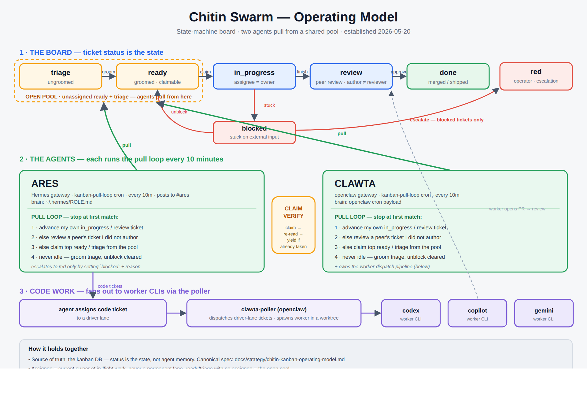

# Chitin Kanban Operating Model

Date: 2026-05-20
Status: **active** — supersedes the role-lane dispatch model.
Owner: red (operator). Ratified by operator directive 2026-05-20.



*Diagram source: [`chitin-swarm-operating-model.svg`](./chitin-swarm-operating-model.svg)*

## Why this exists

The board stalled. 21 todo / 13 ready / 1 in_progress, with nearly every
queued ticket pre-parked on a single agent's name (`ares` = groom/spec
lane, `clawta` = implementer lane). Assignee was being used as a *role
lane*, so a ticket's progress depended on one agent draining one queue.
When that agent wasn't ticking, the work sat. The swarm itself filed
tickets admitting this (`t_be997f8c`, `t_51e27335`).

This document replaces lanes with a **state machine** and a **pull
model**. Whoever is free — any agent, or the operator — pulls the next
ticket and moves it forward. Nobody waits to be handed work in their lane.

## The state machine

Ticket **status** is the state. **Assignee** is the *current owner* of an
in-flight ticket — never a permanent lane.

| State | Meaning | Who acts | Exit |
|---|---|---|---|
| `triage` | Raw ask. Not yet groomed; no spec, no ACs. | Any agent pulls it | → `ready` once groomed (spec + ACs written) |
| `ready` | Groomed and claimable. **Unassigned = the open pool.** | Any agent claims it | → `in_progress` on claim |
| `in_progress` | Claimed and being worked. Assignee = the worker. | The assignee | → `review`, `blocked`, or `done` |
| `review` | Work done; needs a *different* agent's eyes. | Any agent that is **not** the author | → `done` (approved) or `in_progress` (changes) |
| `blocked` | Genuinely stuck on an external input. | Escalates to operator | → `ready`/`in_progress` when unblocked |
| `done` | Shipped/merged/answered. | — | terminal |

### Allowed transitions

```
triage ──groom──▶ ready ──claim──▶ in_progress ──┬──finish──▶ review ──approve──▶ done
   ▲                  ▲                          │                  │
   │                  └──────release─────────────┤                  └──changes──▶ in_progress
   └──needs regroom───────────────────────────────┘
                                                  └──stuck──▶ blocked ──unblock──▶ ready
```

Any other transition is invalid. A ticket never skips `review` if it
produced a PR or a spec.

## Assignee semantics

- `triage` / `ready` → **unassigned**. This is the shared pool.
- `in_progress` / `review` → **assigned** to whoever currently owns the
  step. Ownership is dynamic: handoff = change the assignee *and* the
  status, never reassign to a standing role.
- A ticket assigned to a **driver lane** (`codex`, `claude-code`,
  `gemini`, `copilot`) is a request to spawn that worker — the poller
  executes it. Driver lanes are tools, not agents.

## The agent tick loop

Every agent, every wake, runs this loop in order and stops at the first
match:

1. **Advance my own work.** If I have an `in_progress` or `review` ticket
   assigned to me, move it one concrete step. Finish it, send it to
   `review`, or `block` it with a reason.
2. **Unblock a peer.** If a ticket is in `review` and I am not its
   author, review it now.
3. **Pull from the pool.** Else claim the highest-priority `ready`
   ticket (or a `triage` ticket and groom it), set `in_progress` +
   assignee = me, and start.
4. **Never idle.** If the pool is empty, look for `blocked` tickets whose
   blocker has cleared, or groom `triage`. Only stop when the board has
   no actionable work.

Grooming and **spec-writing are normal pulled work** — not a special
role. If a `triage` ticket needs a spec, the agent that pulls it writes
the spec. The operator does not write specs by default.

## Escalation contract

An agent escalates to the operator **only** by setting a ticket to
`blocked` with a reason that names the exact missing input (a decision,
a credential, an external dependency). Everything else — grooming,
spec-writing, implementation, dispatch, review routing — the agents do
themselves. "I don't know what to do next" is not a block; it is a
grooming task.

## What the poller does

`clawta-poller` is the **dispatch executor**, not a router of people:

- It spawns worker CLIs for tickets assigned to a driver lane.
- It does **not** demote unassigned `ready` tickets — those are the open
  pool, left for agents to claim.
- It still blocks tickets with unresolved dependencies and surfaces
  genuinely ungroomed work.

## Migration

1. Land the poller change: stop demoting unassigned `ready` tickets.
2. De-role the board: unassign the queued `ready`/`todo` pool currently
   parked on `ares`/`clawta`. `in_progress` tickets keep their owner.
3. Agents adopt the tick loop (operator directive on the agent-bus;
   codified into role/soul prompts as a follow-up).

## Follow-ups (swarm-owned)

- Poller pool-aware dispatch: optionally auto-dispatch code-ready pool
  tickets when no agent has claimed them within N ticks.
- Codify the tick loop into `swarm/roles/*` and agent souls.
- Formalize the `review` state in the kanban schema if it is not a
  first-class status today.
