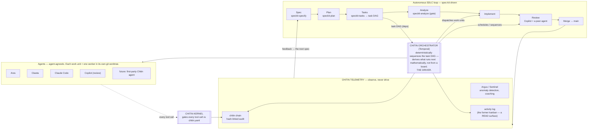

# Chitin — The Swarm Against the SDLC

**2026-05-20 · operator: red** · supersedes the role-lane / board-pull model

> How the Chitin swarm runs the software-development lifecycle **after** the
> 2026-05-20 refocus: the **orchestrator drives**, the kernel gates, telemetry
> observes — and the board is demoted from "the driver" to a read-surface.

## The model in one diagram

## What changed (the 2026-05-20 refocus)

1. **The orchestrator drives — not the board.** Work sequencing and
   scheduling are **derived deterministically** from the spec's task DAG
   (`tasks.md` → dependency graph). The orchestrator computes what runs next
   *mathematically*; there is no heuristic optimizer and no human-managed
   kanban deciding order.

2. **The kanban is demoted to telemetry.** A board / activity log still
   exists — but only as a **read surface**: a projection of orchestrator
   state you can look at. It never decides what work happens. The **Hermes
   Kanban is end-of-life** — its driving role moves into the orchestrator;
   its readable role moves into Chitin Telemetry.

3. **Agent- and driver-agnostic.** The orchestrator dispatches *work units*;
   which agent fulfils one (Ares, Clawta, Claude Code, Copilot, or a future
   **first-party Chitin agent**) is a routing decision, not an architectural
   dependency. No reliance on Hermes plugins or the Hermes Kanban.

4. **Workers + worktrees, always.** Every work unit runs as a worker in its
   own dedicated git worktree (constitution §2; spec 070 FR-013/14). The
   shared checkout is never a work surface.

5. **Determinism end-to-end.** Spec-kit makes the *intent* deterministic
   (spec → plan → tasks); the Temporal orchestrator makes the *execution*
   deterministic (durable, replayable workflows). Telemetry closes the loop.

## The three layers

| Layer | Role | Drives? |
|-------|------|---------|
| **Chitin Kernel** | gates every tool call against policy | gate, not driver |
| **Chitin Orchestrator** | sequences + schedules + dispatches the SDLC | **the driver** |
| **Chitin Telemetry** | the chain + Argus/Sentinel + the activity log | observe, never drive |

Agents are interchangeable executors inside this frame. The board is a
window, not a steering wheel.

> Status: design doc, drawn while spec 070 (Chitin Orchestrator) is in
> implementation. Reconcile `docs/strategy/chitin-swarm-operating-model.svg`
> (the older board-pull model) against this once 070 lands.
